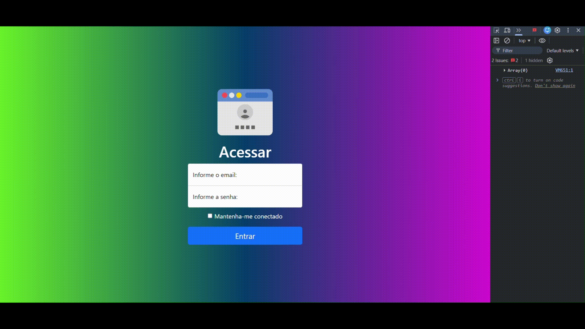

# Projeto - Cadastro

    

    
    
    
    

## 📌 Índice
1. [Descrição](#-descrição)
2. [Funcionalidades](#-funcionalidades)
3. [Tecnologias Utilizadas](#️-tecnologias-utilizadas)
4. [Demonstração da Página](#-demonstração-da-página)
5. [Deploy](#-deploy)
6. [Como executar o projeto](#-como-executar-o-projeto)
7. [Sobre a Autora](#-sobre-a-autora)

## 📋 Descrição

    &emsp;&emsp; Projeto criado na disciplina de Front-End, com a orientação do professor [Leonardo Rocha](https://github.com/leonardossrocha).  
    &emsp;&emsp; O projeto consiste em uma tela de acesso onde o usuário informa seus dados (e-mail e senha) e ao clicar em entrar, o usuário é encaminhado para uma tela de cadastro bem simples, onde ele informa apenas nome.  
    &emsp;&emsp; A tela de cadastro faz uso de arrow function para captar e salvar os nomes cadastrados. Os nomes são exibidos na tela através de uma tabela, seguidos por dois botões sendo eles editar e excluir. O botão editar chama o nome novamente para o campo de texto e permite ao usuário, alterar o nome cadastrado. O nome é removido daquele ponto da lista e adicionado novamente em uma nova posição. O botão excluir, exclui o nome cadastrado, tanto da tabela quanto da lista onde ele foi armazenado.

## ✨ Funcionalidades

- **Botão - Entrar:** Na tela de acesso, é responsável por validar se os campos de e-mail e senha foram preenchidos. Em caso de negativa exibe um 'alert', solicitando o preenchimento de todos os campos. Caso o usuário informe todos os campos, ele é encaminhado diretamente para a tela de cadastro.

- **Armazenamento:** Permite armazenar uma quantidade indeterminada de nomes na memória da variável 'dadosLista', ao recarregar a página os dados são perdidos.

- **Botão - Editar:** Permite a edição do nome cadastrado.

- **Botão - Excluir:** Remove da lista e da memória, o nome informado.

## 🛠️ Tecnologias Utilizadas

- **Bootstrap** → Estrutura base da página de login e estilização de componentes como botões, inputs e tabela.
- **HTML5** → Estrutura da página.
- **CSS3** → Estilização personalizada, incluindo gradiente de fundo, e ajustes visuais sobre o Bootstrap.
- **Javascript** → Validação de formulário, gerenciamento do array de dados e renderização dinâmica da tabela com as ações de salvar, editar e excluir.

## 📸 Demonstração da Página

      

## 🔗 Deploy

    

## 🚀 Como executar o projeto

⚠️ Necessário ter o Git já devidamente instalado, e configurado em seu computador. ⚠️  

Utilizando o git clone, clone o repositório para seu dispositivo local e abra o arquivo **index.html**  

1. Acesse uma pasta do seu computador, através do terminal (VSCode, CMD).  
*Nessa pasta que o git irá armazenar os arquivos, vindo do repositório.*
2. Utilize: `cd` + (endereço da pasta). Exemplo: cd C:\Users\usuário\documentos\projetos  
3. Estando dentro da pasta através do terminal, use o comando: `git clone https://github.com/niveasofia/projeto-cadastro.git  `
4. Localize a pasta onde os arquivos foram clonados.  
*O git clone baixa o repositório em seu computador, como uma pasta.*  
5. Abra a pasta clonada.  
6. Abra o arquivo *`index.html`* no navegador.  

## 👩‍💻 Sobre a Autora

[Nivea Sofia](https://github.com/niveasofia)  

Estudante de Engenharia de Software na Unicesumar, aprimorando e expandindo os conhecimentos sobre HTML, CSS e Javascript em cada projeto. 

